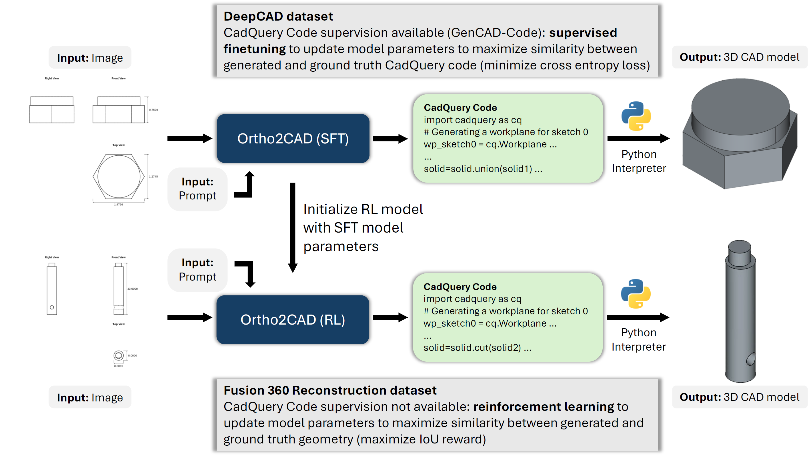

# Ortho2CAD

Ortho2CAD: 3D CAD generation from orthographic drawings using vision language models.

## Overview

Engineering design intent is often communicated through rasterized orthographic drawings. However, downstream workflows inherently require editable and parametrically defined 3D computer-aided design (CAD) models. To bridge this gap, we introduce Ortho2CAD, a vision-language model (VLM) specifically designed to translate rasterized orthographic drawings directly into editable CadQuery code, which can then be seamlessly converted into 3D CAD models. To train the model effectively, we utilize supervised fine-tuning (SFT) for instances where explicit CadQuery code labels already exist, and we apply geometry-grounded reinforcement learning (RL) to optimize the model in scenarios where ground-truth labels are absent. To enable learning at scale, we create a pythonOCC-based drawing generator that renders first-angle orthographic projections from STEP models, complete with dashed hidden lines and key dimensions. On existing datasets encompassing settings both with and without CadQuery supervision, we generate orthographic drawings and show that our model produces 100\% syntactically valid code. Moreover, it achieves a 3D CAD intersection-over-union (IoU) accuracy that surpasses all baselines, with an average relative improvement of over 7\% compared directly against the next best performing model. We show that leveraging VLMs with SFT and RL techniques can effectively pave the way forward for orthographic drawing to 3D CAD reconstruction.



## Setting up the environment

Run the environment setup script from a bash shell:

```bash
bash conda_init.sh
```

The script creates these conda environments:

- `vlmtrl` — training and inference with the VLMs
- `cad_iou` — generating CAD and computing IoU
- `pyocc` — generating orthographic drawings from STEP files

## Datasets

- Download the orthographic drawings dataset from https://huggingface.co/datasets/AdityaJoglekar/Ortho2CAD_Orthographic_Drawings/tree/main: ortho_train_data.zip contains the training json file and the orthographic drawing images for the DeepCAD dataset. f360rec.zip contains the training json file and the orthographic drawing images for the Fusion 360 Reconstruction dataset.
- Download the Fusion 360 Reconstruction dataset (https://github.com/AutodeskAILab/Fusion360GalleryDataset) which contains the STEP files for reinforcement learning.
- Add your paths to the training datasets in `src\qwenvl\data\__init__.py`.
- If DeepCAD STEP files are required: download and prepare data from https://github.com/rundiwu/DeepCAD/tree/master (HDF5 files → export to STEP).
- The test data of 100 examples from each dataset is included under the `inference` folder.
- Please refer to the `orthographic_drawing_generation` folder for instructions and code for generating orthographic drawings given STEP files.

## Training, inference and evaluation

Please use the provided `run.sh` script in the `src` folder for training (SFT and/or RL), inference and evaluation workflows. Please see the comments inside `run.sh` for detailed instructions and available options.

## Acknowledgements

We would like to thank and acknowledge referenced codes from https://github.com/QwenLM/Qwen3-VL/tree/main and https://github.com/anniedoris/CAD-Coder/tree/main.


