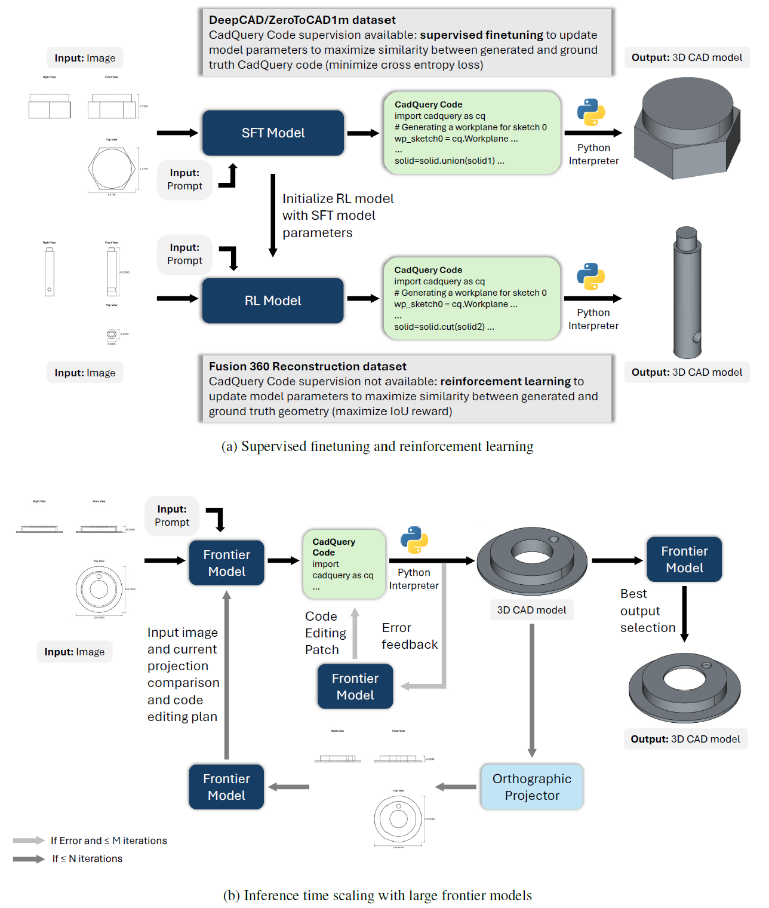

# Ortho2CAD

Ortho2CAD: 3D CAD generation from orthographic drawings using vision language models.

Note: We will add the code for the self-refinement framework with frontier models and relevant files and folders with the new datasets soon!

## Overview

Engineering design intent is often communicated through rasterized orthographic drawings. However, downstream workflows require editable and parametrically defined 3D computer-aided design (CAD) models. To bridge this gap, we introduce vision language model (VLM) frameworks specifically designed to translate rasterized orthographic drawings into editable CadQuery code, which can then be converted into 3D CAD models. Firstly, due to unavailability of large scale orthographic drawing datasets, we create a pythonOCC-based drawing generator that renders first-angle orthographic projections from STEP models, with dashed hidden lines and bounding box dimensions, and generate over 1 million drawings from existing 3D CAD model datasets. We also create a dataset of 100 drawings with manually dimensioned features. We show that supervised fine-tuning applied on small open-source VLMs when paired CadQuery code is available improves reconstruction accuracy on corresponding test sets. For datasets without code labels, geometry-grounded reinforcement learning is performed which uses generated-solid intersection-over-union (IoU) with ground truth solid as the reward, improving code validity and cross-dataset generalization. Then, an inference time self-refinement framework for frontier VLMs is introduced which repeatedly repairs invalid codes and compares orthographic projections of generated 3D models with the input drawing to revise the CadQuery code. Our self-refinement framework with GPT 5.5 achieves 100% valid code generation and the highest mean IoU across all test sets, with an average relative improvement of more than 11% over the next-best method. We show that leveraging VLMs can effectively pave the way forward for orthographic drawing to 3D CAD reconstruction.



## Setting up the environment

Run the environment setup script from a bash shell:

```bash
bash conda_init.sh
```

The script creates these conda environments:

- `vlmtrl` — training and inference with the VLMs
- `cad_iou` — generating CAD and computing IoU
- `pyocc` — generating orthographic drawings from STEP files

## Datasets

- Download the orthographic drawings dataset from https://huggingface.co/datasets/AdityaJoglekar/Ortho2CAD_Orthographic_Drawings/tree/main: ortho_train_data.zip contains the training json file and the orthographic drawing images for the DeepCAD dataset. f360rec.zip contains the training json file and the orthographic drawing images for the Fusion 360 Reconstruction dataset.
- Download the Fusion 360 Reconstruction dataset (https://github.com/AutodeskAILab/Fusion360GalleryDataset) which contains the STEP files for reinforcement learning.
- Add your paths to the training datasets in `src\qwenvl\data\__init__.py`.
- If DeepCAD STEP files are required: download and prepare data from https://github.com/rundiwu/DeepCAD/tree/master (HDF5 files → export to STEP).
- The test data of 100 examples from each dataset is included under the `inference` folder.
- Please refer to the `orthographic_drawing_generation` folder for instructions and code for generating orthographic drawings given STEP files.

## Training, inference and evaluation

Please use the provided `run.sh` script in the `src` folder for training (SFT and/or RL), inference and evaluation workflows. Please see the comments inside `run.sh` for detailed instructions and available options.

## Acknowledgements

We would like to thank and acknowledge referenced codes from https://github.com/QwenLM/Qwen3-VL/tree/main and https://github.com/anniedoris/CAD-Coder/tree/main.

## Bibtex

If you find this code useful, please cite our paper (TBD, once published we will update this section). Aditya Joglekar, Amit Regmi, Kenji Shimada, Levent Burak Kara. Ortho2CAD: 3D CAD generation from orthographic drawings using vision language models. TBD.
